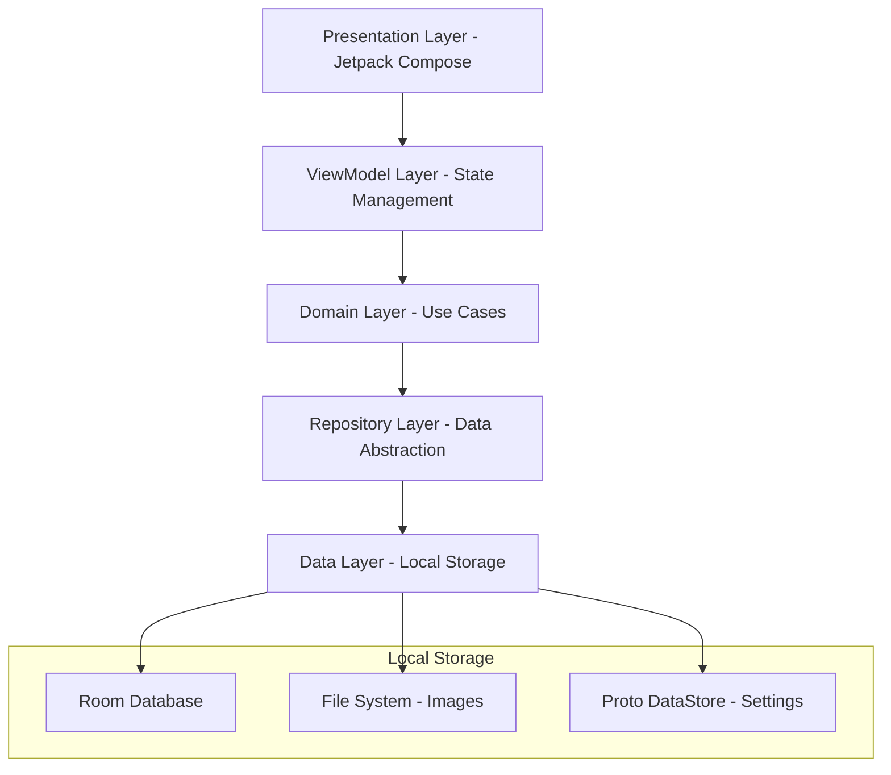

# Design Document

## Overview

CardVault is an offline-first Android digital wallet application built with Jetpack Compose, following MVVM architecture with Unidirectional Data Flow (UDF). The application handles two distinct card processing workflows: textual cards (Credit/Debit) with OCR/ML capabilities, and image-only cards (Gym/Voucher/Gift Card/Event/Parking Pass/Play Arena/Other) for visual storage. All data remains local with no network dependencies, ensuring complete privacy and security.

### Key Design Principles
- **Offline-First**: Zero network dependencies, all processing and storage local with explicit network permission blocking
- **Performance-Oriented**: 60fps animations, <3s app launch on mid-range devices, efficient memory usage
- **Type-Safe**: Leveraging Kotlin's type system and Compose's declarative UI
- **Modular Architecture**: Clear separation of concerns with feature-based organization
- **Material Design 3**: Modern UI with smooth animations and accessibility support
- **Privacy-Centric**: No analytics, tracking, or data collection with complete user control
- **Data Portability**: Comprehensive export/import system for device migration

## Architecture

### High-Level Architecture



### Package Structure

```
com.technitedminds.wallet/
├── data/
│   ├── local/
│   │   ├── database/
│   │   │   ├── entities/
│   │   │   │   ├── CardEntity.kt
│   │   │   │   ├── CategoryEntity.kt
│   │   │   │   └── CardCategoryEntity.kt
│   │   │   ├── dao/
│   │   │   │   ├── CardDao.kt
│   │   │   │   └── CategoryDao.kt
│   │   │   └── WalletDatabase.kt
│   │   ├── files/
│   │   │   └── ImageFileManager.kt
│   │   └── preferences/
│   │       └── UserPreferencesManager.kt
│   ├── repository/
│   │   ├── CardRepositoryImpl.kt
│   │   ├── CategoryRepositoryImpl.kt
│   │   └── ImageRepositoryImpl.kt
│   └── mapper/
│       ├── CardMapper.kt
│       └── CategoryMapper.kt
├── domain/
│   ├── model/
│   │   ├── Card.kt
│   │   ├── CardType.kt
│   │   ├── Category.kt
│   │   └── CardImage.kt
│   ├── repository/
│   │   ├── CardRepository.kt
│   │   ├── CategoryRepository.kt
│   │   └── ImageRepository.kt
│   ├── usecase/
│   │   ├── card/
│   │   │   ├── AddCardUseCase.kt
│   │   │   ├── GetCardsUseCase.kt
│   │   │   ├── UpdateCardUseCase.kt
│   │   │   └── DeleteCardUseCase.kt
│   │   ├── ocr/
│   │   │   └── ProcessCardImageUseCase.kt
│   │   ├── category/
│   │   │   ├── GetCategoriesUseCase.kt
│   │   │   └── ManageCategoryUseCase.kt
│   │   └── export/
│   │       ├── ExportDataUseCase.kt
│   │       └── ImportDataUseCase.kt
│   └── util/
│       ├── CardValidator.kt
│       └── ImageProcessor.kt
├── presentation/
│   ├── screens/
│   │   ├── home/
│   │   │   ├── HomeScreen.kt
│   │   │   ├── HomeViewModel.kt
│   │   │   └── components/
│   │   │       ├── CardListItem.kt
│   │   │       └── CardGrid.kt
│   │   ├── add_card/
│   │   │   ├── AddCardScreen.kt
│   │   │   ├── AddCardViewModel.kt
│   │   │   └── components/
│   │   │       ├── CardTypeSelector.kt
│   │   │       ├── CameraCapture.kt
│   │   │       └── CardPreview.kt
│   │   ├── card_detail/
│   │   │   ├── CardDetailScreen.kt
│   │   │   ├── CardDetailViewModel.kt
│   │   │   └── components/
│   │   │       └── FlippableCard.kt
│   │   ├── categories/
│   │   │   ├── CategoriesScreen.kt
│   │   │   └── CategoriesViewModel.kt
│   │   └── settings/
│   │       ├── SettingsScreen.kt
│   │       └── SettingsViewModel.kt
│   ├── components/
│   │   ├── common/
│   │   │   ├── LoadingIndicator.kt
│   │   │   ├── ErrorMessage.kt
│   │   │   └── ConfirmationDialog.kt
│   │   ├── animation/
│   │   │   ├── CardFlipAnimation.kt
│   │   │   ├── SlideInAnimation.kt
│   │   │   └── FadeTransition.kt
│   │   └── camera/
│   │       ├── CameraPreview.kt
│   │       ├── CardOverlay.kt
│   │       └── CaptureButton.kt
│   ├── navigation/
│   │   ├── WalletNavigation.kt
│   │   ├── NavigationDestinations.kt
│   │   └── NavigationArgs.kt
│   └── theme/
│       ├── Color.kt
│       ├── Theme.kt
│       ├── Type.kt
│       └── Animation.kt
├── di/
│   ├── DatabaseModule.kt
│   ├── RepositoryModule.kt
│   ├── UseCaseModule.kt
│   └── CameraModule.kt
└── util/
    ├── Extensions.kt
    ├── Constants.kt
    └── PermissionUtils.kt
```

## Components and Interfaces

### Domain Models

#### Card Model
```kotlin
data class Card(
    val id: String,
    val name: String,
    val type: CardType,
    val categoryId: String,
    val frontImagePath: String,
    val backImagePath: String,
    val extractedData: Map<String, String> = emptyMap(), // OCR extracted data for textual cards
    val customFields: Map<String, String> = emptyMap(), // User-defined additional fields
    val expiryDate: String? = null, // Optional expiry for vouchers/gift cards
    val notes: String? = null, // Optional notes for image cards
    val customGradient: CardGradient? = null, // Custom gradient colors, null uses default
    val createdAt: Long,
    val updatedAt: Long
)

data class CardGradient(
    val startColor: String, // Hex color code
    val endColor: String,   // Hex color code
    val direction: GradientDirection = GradientDirection.TopToBottom
)

enum class GradientDirection {
    TopToBottom, LeftToRight, DiagonalTopLeftToBottomRight, DiagonalTopRightToBottomLeft
}

sealed class CardType {
    /** Credit card type - supports OCR processing for card details extraction */
    object Credit : CardType()
    
    /** Debit card type - supports OCR processing for card details extraction */
    object Debit : CardType()
    
    /** Transport card type - for metro, bus, train, and transit cards */
    object TransportCard : CardType()
    
    /** Gift card type - for gift cards, vouchers, and prepaid cards */
    object GiftCard : CardType()
    
    /** Loyalty card type - for store loyalty and rewards cards */
    object LoyaltyCard : CardType()
    
    /** Membership card type - for gym, club, and organization memberships */
    object MembershipCard : CardType()
    
    /** Insurance card type - for health, auto, and other insurance cards */
    object InsuranceCard : CardType()
    
    /** ID card type - for identification cards, licenses, and permits */
    object IdentificationCard : CardType()
    
    /** Voucher card type - for discount vouchers and promotional cards */
    object Voucher : CardType()
    
    /** Event card type - for event tickets and passes */
    object Event : CardType()
    
    /** Business card type - for business and professional cards */
    object BusinessCard : CardType()
    
    /** Library card type - for library and educational institution cards */
    object LibraryCard : CardType()
    
    /** Hotel card type - for hotel key cards and loyalty cards */
    object HotelCard : CardType()
    
    /** Student card type - for student IDs and campus cards */
    object StudentCard : CardType()
    
    /** Access card type - for building access and security cards */
    object AccessCard : CardType()
    
    /** Custom card type - for user-defined card types */
    data class Custom(val typeName: String) : CardType()
    
    /** Returns true if this card type supports OCR processing */
    fun supportsOCR(): Boolean = when (this) {
        is Credit, is Debit -> true
        else -> false
    }
}
```

#### Category Model
```kotlin
data class Category(
    val id: String,
    val name: String,
    val iconResId: Int,
    val colorHex: String,
    val isDefault: Boolean = false,
    val cardCount: Int = 0 // For display purposes
)
```

#### CardImage Model
```kotlin
data class CardImage(
    val path: String,
    val width: Int,
    val height: Int,
    val sizeBytes: Long,
    val aspectRatio: Float,
    val isOptimized: Boolean = false
)
```

### Repository Interfaces

#### CardRepository
```kotlin
interface CardRepository {
    suspend fun getAllCards(): Flow<List<Card>>
    suspend fun getCardById(id: String): Card?
    suspend fun getCardsByCategory(categoryId: String): Flow<List<Card>>
    suspend fun getCardsByType(type: CardType): Flow<List<Card>>
    suspend fun insertCard(card: Card): String
    suspend fun updateCard(card: Card)
    suspend fun deleteCard(id: String)
    suspend fun searchCards(query: String): Flow<List<Card>>
    suspend fun getCardCount(): Flow<Int>
}
```

#### CategoryRepository
```kotlin
interface CategoryRepository {
    suspend fun getAllCategories(): Flow<List<Category>>
    suspend fun getCategoryById(id: String): Category?
    suspend fun insertCategory(category: Category): String
    suspend fun updateCategory(category: Category)
    suspend fun deleteCategory(id: String)
    suspend fun getDefaultCategories(): List<Category>
    suspend fun getCategoryWithCardCount(id: String): Category?
}
```


#### ImageRepository
```kotlin
interface ImageRepository {
    suspend fun saveImage(imageData: ByteArray, fileName: String): String
    suspend fun getImage(imagePath: String): ByteArray?
    suspend fun deleteImage(imagePath: String): Boolean
    suspend fun getImageFile(imagePath: String): File?
}
```

### Use Cases

#### ProcessCardImageUseCase
```kotlin
class ProcessCardImageUseCase @Inject constructor(
    private val mlKitTextRecognizer: TextRecognizer
) {
    suspend operator fun invoke(
        imageData: ByteArray,
        cardType: CardType
    ): Result<Map<String, String>> {
        return if (cardType.supportsOCR()) {
            processTextualCard(imageData)
        } else {
            Result.success(emptyMap()) // No OCR processing for image-only cards
        }
    }
    
    private suspend fun processTextualCard(imageData: ByteArray): Result<Map<String, String>> {
        // ML Kit OCR implementation for extracting card number, expiry, name
        // Returns map with keys: "cardNumber", "expiryDate", "cardholderName"
    }
}
```

#### AddCardUseCase
```kotlin
class AddCardUseCase @Inject constructor(
    private val cardRepository: CardRepository,
    private val imageRepository: ImageRepository,
    private val cardValidator: CardValidator
) {
    suspend operator fun invoke(
        name: String,
        type: CardType,
        categoryId: String,
        frontImageData: ByteArray,
        backImageData: ByteArray,
        extractedData: Map<String, String> = emptyMap(),
        customFields: Map<String, String> = emptyMap(),
        expiryDate: String? = null,
        notes: String? = null
    ): Result<String> {
        // Validation, image storage, and card creation logic
    }
}
```

#### ShareCardUseCase
```kotlin
class ShareCardUseCase @Inject constructor(
    private val imageRepository: ImageRepository,
    private val cardGradientGenerator: CardGradientGenerator
) {
    suspend operator fun invoke(
        card: Card,
        shareOption: ShareOption
    ): Result<List<String>> {
        return if (card.type.supportsOCR()) {
            // For textual cards (Credit/Debit), generate gradient card design with extracted details
            shareTextualCard(card, shareOption)
        } else {
            // For image-only cards, share the captured images
            shareImageCard(card, shareOption)
        }
    }
    
    private suspend fun shareTextualCard(card: Card, shareOption: ShareOption): Result<List<String>> {
        // Generate gradient card design showing all extracted details including CVV
        val gradientCardImage = cardGradientGenerator.generateCardImage(
            card = card,
            showAllDetails = true, // Include CVV and all sensitive information
            includeBack = shareOption == ShareOption.BothSides || shareOption == ShareOption.BackOnly
        )
        return Result.success(listOf(gradientCardImage))
    }
    
    private suspend fun shareImageCard(card: Card, shareOption: ShareOption): Result<List<String>> {
        // Share the actual captured images
        return when (shareOption) {
            ShareOption.FrontOnly -> {
                Result.success(listOf(card.frontImagePath))
            }
            ShareOption.BackOnly -> {
                Result.success(listOf(card.backImagePath))
            }
            ShareOption.BothSides -> {
                Result.success(listOf(card.frontImagePath, card.backImagePath))
            }
        }
    }
}

enum class ShareOption {
    FrontOnly, BackOnly, BothSides
}
```

### UI Components

#### FlippableCard Component
```kotlin
@Composable
fun FlippableCard(
    card: Card,
    isFlipped: Boolean,
    onFlip: () -> Unit,
    onShare: (ShareOption) -> Unit,
    modifier: Modifier = Modifier
) {
    val rotation by animateFloatAsState(
        targetValue = if (isFlipped) 180f else 0f,
        animationSpec = tween(durationMillis = 300, easing = FastOutSlowInEasing)
    )
    
    Box(
        modifier = modifier
            .graphicsLayer {
                rotationY = rotation
                cameraDistance = 12f * density
            }
    ) {
        if (rotation <= 90f) {
            CardFront(
                card = card,
                onFlip = onFlip,
                onShare = { onShare(ShareOption.FrontOnly) }
            )
        } else {
            CardBack(
                card = card,
                onFlip = onFlip,
                onShare = { onShare(ShareOption.BackOnly) },
                modifier = Modifier.graphicsLayer { rotationY = 180f }
            )
        }
    }
}

@Composable
fun CardFront(
    card: Card,
    onFlip: () -> Unit,
    onShare: () -> Unit,
    modifier: Modifier = Modifier
) {
    Card(
        modifier = modifier
            .fillMaxWidth()
            .aspectRatio(1.586f) // Standard card ratio
            .clickable { onFlip() }
    ) {
        Box {
            AsyncImage(
                model = card.frontImagePath,
                contentDescription = "Front of ${card.name}",
                modifier = Modifier.fillMaxSize(),
                contentScale = ContentScale.Crop
            )
            
            // Share button overlay
            IconButton(
                onClick = onShare,
                modifier = Modifier.align(Alignment.TopEnd)
            ) {
                Icon(Icons.Default.Share, contentDescription = "Share front")
            }
        }
    }
}

@Composable
fun CardBack(
    card: Card,
    onFlip: () -> Unit,
    onShare: () -> Unit,
    modifier: Modifier = Modifier
) {
    Card(
        modifier = modifier
            .fillMaxWidth()
            .aspectRatio(1.586f)
            .clickable { onFlip() }
    ) {
        Box {
            AsyncImage(
                model = card.backImagePath,
                contentDescription = "Back of ${card.name}",
                modifier = Modifier.fillMaxSize(),
                contentScale = ContentScale.Crop
            )
            
            // Share button overlay
            IconButton(
                onClick = onShare,
                modifier = Modifier.align(Alignment.TopEnd)
            ) {
                Icon(Icons.Default.Share, contentDescription = "Share back")
            }
        }
    }
}
```

#### CameraCapture Component
```kotlin
@Composable
fun CameraCapture(
    onImageCaptured: (ByteArray) -> Unit,
    cardType: CardType,
    captureStep: CaptureStep = CaptureStep.Front,
    aspectRatio: AspectRatio = AspectRatio.RATIO_16_9,
    showOverlay: Boolean = true,
    modifier: Modifier = Modifier
) {
    val context = LocalContext.current
    val lifecycleOwner = LocalLifecycleOwner.current
    
    AndroidView(
        factory = { ctx ->
            PreviewView(ctx).apply {
                // CameraX implementation with optimized settings for card scanning
            }
        },
        modifier = modifier
    ) { previewView ->
        // Camera setup and capture logic
    }
    
    if (showOverlay) {
        CardOverlay(
            aspectRatio = aspectRatio,
            captureStep = captureStep,
            cardType = cardType
        )
    }
}

enum class CaptureStep {
    Front, Back
}
```

#### CardTypeSelector Component
```kotlin
@Composable
fun CardTypeSelector(
    selectedType: CardType?,
    selectedGradient: CardGradient?,
    onTypeSelected: (CardType) -> Unit,
    onGradientSelected: (CardGradient?) -> Unit,
    modifier: Modifier = Modifier
) {
    LazyVerticalGrid(
        columns = GridCells.Fixed(2),
        modifier = modifier
    ) {
        // Cards with OCR processing
        item(span = { GridItemSpan(2) }) {
            Text("Cards with Text Recognition")
        }
        items(listOf(CardType.Credit, CardType.Debit)) { type ->
            CardTypeItem(
                type = type,
                isSelected = selectedType == type,
                onClick = { onTypeSelected(type) },
                gradient = selectedGradient?.let { getCustomGradient(it) } 
                    ?: getDefaultCardTypeGradient(type),
                onCustomizeGradient = { onGradientSelected(it) }
            )
        }
        
        // Image-only cards section
        item(span = { GridItemSpan(2) }) {
            Text("Image-Only Cards")
        }
        items(listOf(
            CardType.TransportCard, CardType.GiftCard, CardType.LoyaltyCard,
            CardType.MembershipCard, CardType.InsuranceCard, CardType.IdentificationCard,
            CardType.Voucher, CardType.Event, CardType.BusinessCard,
            CardType.LibraryCard, CardType.HotelCard, CardType.StudentCard,
            CardType.AccessCard
        )) { type ->
            CardTypeItem(
                type = type,
                isSelected = selectedType == type,
                onClick = { onTypeSelected(type) },
                gradient = selectedGradient?.let { getCustomGradient(it) } 
                    ?: getDefaultCardTypeGradient(type),
                onCustomizeGradient = { onGradientSelected(it) }
            )
        }
    }
}

@Composable
fun CardTypeItem(
    type: CardType,
    isSelected: Boolean,
    onClick: () -> Unit,
    gradient: Brush,
    onCustomizeGradient: (CardGradient?) -> Unit,
    modifier: Modifier = Modifier
) {
    Card(
        modifier = modifier
            .fillMaxWidth()
            .aspectRatio(1.586f)
            .clickable { onClick() },
        border = if (isSelected) BorderStroke(2.dp, MaterialTheme.colorScheme.primary) else null
    ) {
        Box(
            modifier = Modifier
                .fillMaxSize()
                .background(gradient),
            contentAlignment = Alignment.Center
        ) {
            Column(
                horizontalAlignment = Alignment.CenterHorizontally
            ) {
                Icon(
                    imageVector = getCardTypeIcon(type),
                    contentDescription = null,
                    tint = Color.White,
                    modifier = Modifier.size(32.dp)
                )
                Spacer(modifier = Modifier.height(8.dp))
                Text(
                    text = getCardTypeName(type),
                    color = Color.White,
                    style = MaterialTheme.typography.bodyMedium,
                    fontWeight = FontWeight.Medium
                )
            }
            
            // Gradient customization button
            IconButton(
                onClick = { 
                    // Show gradient picker dialog
                    onCustomizeGradient(null) // Will trigger gradient picker
                },
                modifier = Modifier.align(Alignment.TopEnd)
            ) {
                Icon(
                    imageVector = Icons.Default.Palette,
                    contentDescription = "Customize gradient",
                    tint = Color.White.copy(alpha = 0.7f),
                    modifier = Modifier.size(16.dp)
                )
            }
        }
    }
}

fun getDefaultCardTypeGradient(type: CardType): Brush {
    return when (type) {
        CardType.Credit -> Brush.linearGradient(
            colors = listOf(Color(0xFF667eea), Color(0xFF764ba2))
        )
        CardType.Debit -> Brush.linearGradient(
            colors = listOf(Color(0xFFf093fb), Color(0xFFf5576c))
        )
        CardType.TransportCard -> Brush.linearGradient(
            colors = listOf(Color(0xFF4facfe), Color(0xFF00f2fe))
        )
        CardType.GiftCard -> Brush.linearGradient(
            colors = listOf(Color(0xFFa8edea), Color(0xFFfed6e3))
        )
        CardType.LoyaltyCard -> Brush.linearGradient(
            colors = listOf(Color(0xFFffecd2), Color(0xFFfcb69f))
        )
        CardType.MembershipCard -> Brush.linearGradient(
            colors = listOf(Color(0xFF43e97b), Color(0xFF38f9d7))
        )
        CardType.InsuranceCard -> Brush.linearGradient(
            colors = listOf(Color(0xFFd299c2), Color(0xFFfef9d7))
        )
        CardType.IdentificationCard -> Brush.linearGradient(
            colors = listOf(Color(0xFF89f7fe), Color(0xFF66a6ff))
        )
        CardType.Voucher -> Brush.linearGradient(
            colors = listOf(Color(0xFFfa709a), Color(0xFFfee140))
        )
        CardType.Event -> Brush.linearGradient(
            colors = listOf(Color(0xFFffecd2), Color(0xFFfcb69f))
        )
        CardType.BusinessCard -> Brush.linearGradient(
            colors = listOf(Color(0xFF667eea), Color(0xFF764ba2))
        )
        CardType.LibraryCard -> Brush.linearGradient(
            colors = listOf(Color(0xFF43e97b), Color(0xFF38f9d7))
        )
        CardType.HotelCard -> Brush.linearGradient(
            colors = listOf(Color(0xFFa8edea), Color(0xFFfed6e3))
        )
        CardType.StudentCard -> Brush.linearGradient(
            colors = listOf(Color(0xFF89f7fe), Color(0xFF66a6ff))
        )
        CardType.AccessCard -> Brush.linearGradient(
            colors = listOf(Color(0xFFd299c2), Color(0xFFfef9d7))
        )
        is CardType.Custom -> Brush.linearGradient(
            colors = listOf(Color(0xFF667eea), Color(0xFF764ba2))
        )
    }
}

fun getCustomGradient(cardGradient: CardGradient): Brush {
    val startColor = Color(android.graphics.Color.parseColor(cardGradient.startColor))
    val endColor = Color(android.graphics.Color.parseColor(cardGradient.endColor))
    
    return when (cardGradient.direction) {
        GradientDirection.TopToBottom -> Brush.verticalGradient(
            colors = listOf(startColor, endColor)
        )
        GradientDirection.LeftToRight -> Brush.horizontalGradient(
            colors = listOf(startColor, endColor)
        )
        GradientDirection.DiagonalTopLeftToBottomRight -> Brush.linearGradient(
            colors = listOf(startColor, endColor),
            start = Offset.Zero,
            end = Offset.Infinite
        )
        GradientDirection.DiagonalTopRightToBottomLeft -> Brush.linearGradient(
            colors = listOf(startColor, endColor),
            start = Offset(Float.POSITIVE_INFINITY, 0f),
            end = Offset(0f, Float.POSITIVE_INFINITY)
        )
    }
}

@Composable
fun GradientPickerDialog(
    currentGradient: CardGradient?,
    cardType: CardType,
    onGradientSelected: (CardGradient?) -> Unit,
    onDismiss: () -> Unit
) {
    var startColor by remember { 
        mutableStateOf(currentGradient?.startColor ?: getDefaultGradientColors(cardType).first) 
    }
    var endColor by remember { 
        mutableStateOf(currentGradient?.endColor ?: getDefaultGradientColors(cardType).second) 
    }
    var direction by remember { 
        mutableStateOf(currentGradient?.direction ?: GradientDirection.TopToBottom) 
    }
    
    AlertDialog(
        onDismissRequest = onDismiss,
        title = { Text("Customize Card Gradient") },
        text = {
            Column {
                // Color pickers for start and end colors
                ColorPickerRow(
                    label = "Start Color",
                    selectedColor = startColor,
                    onColorSelected = { startColor = it }
                )
                
                Spacer(modifier = Modifier.height(16.dp))
                
                ColorPickerRow(
                    label = "End Color",
                    selectedColor = endColor,
                    onColorSelected = { endColor = it }
                )
                
                Spacer(modifier = Modifier.height(16.dp))
                
                // Direction selector
                Text("Gradient Direction")
                LazyRow {
                    items(GradientDirection.values()) { dir ->
                        FilterChip(
                            selected = direction == dir,
                            onClick = { direction = dir },
                            label = { Text(dir.name) }
                        )
                    }
                }
                
                Spacer(modifier = Modifier.height(16.dp))
                
                // Preview
                Card(
                    modifier = Modifier
                        .fillMaxWidth()
                        .height(100.dp)
                ) {
                    Box(
                        modifier = Modifier
                            .fillMaxSize()
                            .background(
                                getCustomGradient(
                                    CardGradient(startColor, endColor, direction)
                                )
                            ),
                        contentAlignment = Alignment.Center
                    ) {
                        Text(
                            text = "Preview",
                            color = Color.White,
                            fontWeight = FontWeight.Bold
                        )
                    }
                }
            }
        },
        confirmButton = {
            TextButton(
                onClick = {
                    onGradientSelected(CardGradient(startColor, endColor, direction))
                    onDismiss()
                }
            ) {
                Text("Apply")
            }
        },
        dismissButton = {
            TextButton(
                onClick = {
                    onGradientSelected(null) // Reset to default
                    onDismiss()
                }
            ) {
                Text("Use Default")
            }
        }
    )
}

fun getDefaultGradientColors(cardType: CardType): Pair<String, String> {
    return when (cardType) {
        CardType.Credit -> Pair("#667eea", "#764ba2")
        CardType.Debit -> Pair("#f093fb", "#f5576c")
        CardType.TransportCard -> Pair("#4facfe", "#00f2fe")
        CardType.GiftCard -> Pair("#a8edea", "#fed6e3")
        CardType.LoyaltyCard -> Pair("#ffecd2", "#fcb69f")
        CardType.MembershipCard -> Pair("#43e97b", "#38f9d7")
        CardType.InsuranceCard -> Pair("#d299c2", "#fef9d7")
        CardType.IdentificationCard -> Pair("#89f7fe", "#66a6ff")
        CardType.Voucher -> Pair("#fa709a", "#fee140")
        CardType.Event -> Pair("#ffecd2", "#fcb69f")
        CardType.BusinessCard -> Pair("#667eea", "#764ba2")
        CardType.LibraryCard -> Pair("#43e97b", "#38f9d7")
        CardType.HotelCard -> Pair("#a8edea", "#fed6e3")
        CardType.StudentCard -> Pair("#89f7fe", "#66a6ff")
        CardType.AccessCard -> Pair("#d299c2", "#fef9d7")
        is CardType.Custom -> Pair("#667eea", "#764ba2")
    }
}
```

## Data Models

### Database Schema

#### Room Entities

```kotlin
@Entity(tableName = "cards")
data class CardEntity(
    @PrimaryKey val id: String,
    val name: String,
    val type: String,
    val categoryId: String,
    val frontImagePath: String,
    val backImagePath: String,
    val extractedDataJson: String,
    val customFieldsJson: String,
    val createdAt: Long,
    val updatedAt: Long
)

@Entity(tableName = "categories")
data class CategoryEntity(
    @PrimaryKey val id: String,
    val name: String,
    val iconResId: Int,
    val colorHex: String,
    val isDefault: Boolean
)
```

#### Database Configuration
```kotlin
@Database(
    entities = [CardEntity::class, CategoryEntity::class],
    version = 1,
    exportSchema = false
)
@TypeConverters(Converters::class)
abstract class WalletDatabase : RoomDatabase() {
    abstract fun cardDao(): CardDao
    abstract fun categoryDao(): CategoryDao
}
```

### File Storage Structure
```
/data/data/com.technitedminds.wallet/files/
├── images/
│   ├── cards/
│   │   ├── {cardId}_front.jpg
│   │   └── {cardId}_back.jpg
│   └── temp/
│       ├── capture_temp_front.jpg
│       └── capture_temp_back.jpg
└── preferences/
    └── user_preferences.pb
```

## Error Handling

### Error Types
```kotlin
sealed class WalletError : Exception() {
    object CameraPermissionDenied : WalletError()
    object ImageProcessingFailed : WalletError()
    object DatabaseError : WalletError()
    object FileSystemError : WalletError()
    object OCRProcessingFailed : WalletError()
    object ShareFailed : WalletError()
    object StorageSpaceInsufficient : WalletError()
    data class ValidationError(val field: String, val message: String) : WalletError()
}
```

### Error Handling Strategy
- **UI Level**: Display user-friendly error messages with retry options
- **ViewModel Level**: Convert domain errors to UI states
- **Repository Level**: Handle data source errors and provide fallbacks
- **Use Case Level**: Validate business rules and return Result types

### Offline Error Handling
```kotlin
class OfflineErrorHandler {
    fun handleError(error: Throwable): WalletError {
        return when (error) {
            is NetworkException -> WalletError.NetworkNotAllowed
            is SQLiteException -> WalletError.DatabaseError
            is IOException -> WalletError.FileSystemError
            else -> WalletError.DatabaseError
        }
    }
}
```

## Testing Strategy

### Unit Testing
- **ViewModels**: Test state management and business logic
- **Use Cases**: Test business rules and data transformations
- **Repositories**: Test data access and caching logic
- **Utilities**: Test helper functions and extensions

### Integration Testing
- **Database**: Test Room DAOs and database operations
- **File System**: Test image storage and retrieval
- **OCR Processing**: Test ML Kit integration with sample images

### UI Testing
- **Compose Tests**: Test UI components and interactions
- **Navigation Tests**: Test screen transitions and argument passing
- **Animation Tests**: Test animation states and transitions

### Testing Architecture
```kotlin
// Example ViewModel Test
@Test
fun `when adding textual card, should process OCR and save card`() = runTest {
    // Given
    val mockImage = byteArrayOf(1, 2, 3)
    val expectedOcrData = mapOf("number" to "1234-5678-9012-3456")
    
    // When
    viewModel.addCard(
        name = "Test Card",
        type = CardType.Credit,
        frontImage = mockImage,
        backImage = mockImage
    )
    
    // Then
    verify(mockProcessCardImageUseCase).invoke(mockImage, CardType.Credit)
    verify(mockAddCardUseCase).invoke(any())
    assertEquals(UiState.Success, viewModel.uiState.value)
}
```

### Performance Testing
- **Animation Performance**: Measure frame rates during card flip animations
- **Memory Usage**: Monitor bitmap memory consumption
- **Database Performance**: Test query performance with large datasets
- **App Launch Time**: Measure cold start performance

## Data Storage Considerations

### Local Storage Strategy
- **Plain Storage**: Data stored without encryption for simplicity
- **Sandboxed Directory**: All data confined to app's private storage
- **File Organization**: Structured directory layout for easy management

### Data Validation
```kotlin
class CardValidator {
    fun validateCard(card: Card): ValidationResult {
        return when {
            card.name.isBlank() -> ValidationResult.Error("Card name is required")
            card.name.length > 50 -> ValidationResult.Error("Card name too long (max 50 characters)")
            card.frontImagePath.isBlank() -> ValidationResult.Error("Front image is required")
            card.backImagePath.isBlank() -> ValidationResult.Error("Back image is required")
            card.categoryId.isBlank() -> ValidationResult.Error("Category selection is required")
            !isValidExpiryDate(card.expiryDate) -> ValidationResult.Error("Invalid expiry date format")
            else -> ValidationResult.Success
        }
    }
    
    private fun isValidExpiryDate(expiryDate: String?): Boolean {
        if (expiryDate.isNullOrBlank()) return true // Optional field
        return expiryDate.matches(Regex("^(0[1-9]|1[0-2])/([0-9]{2})$"))
    }
}

sealed class ValidationResult {
    object Success : ValidationResult()
    data class Error(val message: String) : ValidationResult()
}
```

### Image Sharing Strategy

#### Share Implementation
```kotlin
class ImageSharingManager @Inject constructor(
    private val context: Context
) {
    suspend fun shareCardImages(
        imagePaths: List<String>,
        cardName: String
    ): Result<Unit> {
        return try {
            // All cards (including textual cards like credit/debit) are shared as images
            // No sensitive text data is shared, only the captured card images
            val imageUris = imagePaths.map { path ->
                FileProvider.getUriForFile(
                    context,
                    "${context.packageName}.fileprovider",
                    File(path)
                )
            }
            
            val shareIntent = Intent().apply {
                if (imageUris.size == 1) {
                    action = Intent.ACTION_SEND
                    putExtra(Intent.EXTRA_STREAM, imageUris.first())
                } else {
                    action = Intent.ACTION_SEND_MULTIPLE
                    putParcelableArrayListExtra(Intent.EXTRA_STREAM, ArrayList(imageUris))
                }
                type = "image/*"
                putExtra(Intent.EXTRA_SUBJECT, cardName)
                addFlags(Intent.FLAG_GRANT_READ_URI_PERMISSION)
            }
            
            context.startActivity(Intent.createChooser(shareIntent, "Share $cardName"))
            Result.success(Unit)
        } catch (e: Exception) {
            Result.failure(WalletError.ShareFailed)
        }
    }
}

### Modern Gradient Color System

#### Card Type Visual Identity
Each card type has a unique modern gradient that provides visual distinction and enhances the user experience:

**OCR-Enabled Cards:**
- **Credit Cards**: Purple to blue gradient (professional banking feel)
- **Debit Cards**: Pink to red gradient (vibrant and accessible)

**Image-Only Cards:**
- **Transport Cards**: Blue to cyan gradient (tech-forward and transit)
- **Gift Cards**: Soft teal to pink gradient (friendly and gift-like)
- **Loyalty Cards**: Cream to peach gradient (warm and rewarding)
- **Membership Cards**: Green to teal gradient (health and community)
- **Insurance Cards**: Purple to cream gradient (official and secure)
- **ID Cards**: Light blue to blue gradient (official and trustworthy)
- **Vouchers**: Pink to yellow gradient (exciting and promotional)
- **Event Cards**: Cream to peach gradient (warm and celebratory)
- **Business Cards**: Purple to blue gradient (professional and corporate)
- **Library Cards**: Green to teal gradient (educational and knowledge)
- **Hotel Cards**: Soft teal to pink gradient (hospitality and comfort)
- **Student Cards**: Light blue to blue gradient (academic and youthful)
- **Access Cards**: Purple to cream gradient (security and access)
```

## Design Decisions and Rationales

### Card Type Architecture
**Decision**: Use sealed class with specific types rather than generic string-based types
**Rationale**: Provides compile-time safety, enables different processing workflows (OCR vs image-only), and allows for type-specific UI behavior

### Dual Processing Workflows
**Decision**: Separate processing paths for textual cards (with OCR) and image cards (without OCR)
**Rationale**: Meets requirement for different card handling approaches, optimizes performance by avoiding unnecessary OCR processing, and provides appropriate UI flows for each type

### Universal Card Flip Animation
**Decision**: Implement 3D flip animation for both textual and image-only card types
**Rationale**: Provides consistent user experience across all card types, meets animation requirements, and allows users to view both sides of any card regardless of type

### Image Sharing Strategy
**Decision**: Share all cards (textual and image-only) as captured images with flexible options (front only, back only, both sides)
**Rationale**: Maintains consistency across card types, protects sensitive text data by sharing only images, gives users control over what they share, and supports different use cases while maintaining privacy

### Modern Gradient Design System
**Decision**: Implement unique gradient colors for each card type with modern color palettes, plus custom gradient options
**Rationale**: Provides visual distinction between card types, enhances user experience with appealing aesthetics, improves card recognition and organization, follows modern design trends, and allows user personalization while maintaining consistent defaults

### Custom Gradient System
**Decision**: Allow users to customize gradients for any card type while providing attractive defaults
**Rationale**: Enables personalization and brand matching, maintains visual consistency through defaults, provides creative freedom for users, and supports accessibility through color customization

### Simple Storage Approach
**Decision**: Direct file storage without caching or complex optimization
**Rationale**: Simplifies architecture, reduces complexity, and focuses on core functionality while maintaining acceptable performance for typical use cases

### Offline-First Architecture
**Decision**: Complete local operation without network dependencies
**Rationale**: Ensures privacy requirements are met, prevents data leakage, and provides reliable functionality regardless of connectivity

This design provides a robust, scalable architecture that meets all the requirements while maintaining high performance and user experience standards. The modular structure allows for easy testing and future enhancements while ensuring complete offline operation and data privacy.