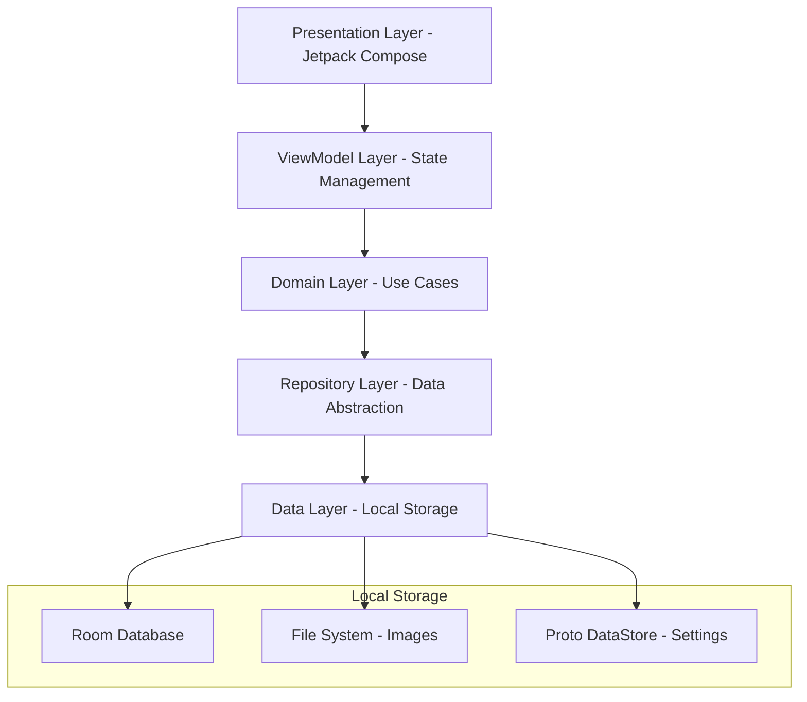

# Design Document

## Overview

CardVault is an offline-first Android digital wallet application built with Jetpack Compose, following MVVM architecture with Unidirectional Data Flow (UDF). The application handles two distinct card processing workflows: textual cards (Credit/Debit/ATM) with OCR/ML capabilities, and image-only cards (Gym/Voucher/etc.) for visual storage. All data remains local with no network dependencies.

### Key Design Principles
- **Offline-First**: Zero network dependencies, all processing and storage local
- **Performance-Oriented**: 60fps animations, <3s app launch, efficient memory usage
- **Type-Safe**: Leveraging Kotlin's type system and Compose's declarative UI
- **Modular Architecture**: Clear separation of concerns with feature-based organization
- **Material Design 3**: Modern UI with smooth animations and accessibility support

## Architecture

### High-Level Architecture



### Package Structure

```
com.technitedminds.wallet/
├── data/
│   ├── local/
│   │   ├── database/
│   │   │   ├── entities/
│   │   │   │   ├── CardEntity.kt
│   │   │   │   ├── CategoryEntity.kt
│   │   │   │   └── CardCategoryEntity.kt
│   │   │   ├── dao/
│   │   │   │   ├── CardDao.kt
│   │   │   │   └── CategoryDao.kt
│   │   │   └── WalletDatabase.kt
│   │   ├── files/
│   │   │   └── ImageFileManager.kt
│   │   └── preferences/
│   │       └── UserPreferencesManager.kt
│   ├── repository/
│   │   ├── CardRepositoryImpl.kt
│   │   ├── CategoryRepositoryImpl.kt
│   │   └── ImageRepositoryImpl.kt
│   └── mapper/
│       ├── CardMapper.kt
│       └── CategoryMapper.kt
├── domain/
│   ├── model/
│   │   ├── Card.kt
│   │   ├── CardType.kt
│   │   ├── Category.kt
│   │   └── CardImage.kt
│   ├── repository/
│   │   ├── CardRepository.kt
│   │   ├── CategoryRepository.kt
│   │   └── ImageRepository.kt
│   ├── usecase/
│   │   ├── card/
│   │   │   ├── AddCardUseCase.kt
│   │   │   ├── GetCardsUseCase.kt
│   │   │   ├── UpdateCardUseCase.kt
│   │   │   └── DeleteCardUseCase.kt
│   │   ├── ocr/
│   │   │   └── ProcessCardImageUseCase.kt
│   │   ├── category/
│   │   │   ├── GetCategoriesUseCase.kt
│   │   │   └── ManageCategoryUseCase.kt
│   │   └── export/
│   │       ├── ExportDataUseCase.kt
│   │       └── ImportDataUseCase.kt
│   └── util/
│       ├── CardValidator.kt
│       └── ImageProcessor.kt
├── presentation/
│   ├── screens/
│   │   ├── home/
│   │   │   ├── HomeScreen.kt
│   │   │   ├── HomeViewModel.kt
│   │   │   └── components/
│   │   │       ├── CardListItem.kt
│   │   │       └── CardGrid.kt
│   │   ├── add_card/
│   │   │   ├── AddCardScreen.kt
│   │   │   ├── AddCardViewModel.kt
│   │   │   └── components/
│   │   │       ├── CardTypeSelector.kt
│   │   │       ├── CameraCapture.kt
│   │   │       └── CardPreview.kt
│   │   ├── card_detail/
│   │   │   ├── CardDetailScreen.kt
│   │   │   ├── CardDetailViewModel.kt
│   │   │   └── components/
│   │   │       └── FlippableCard.kt
│   │   ├── categories/
│   │   │   ├── CategoriesScreen.kt
│   │   │   └── CategoriesViewModel.kt
│   │   └── settings/
│   │       ├── SettingsScreen.kt
│   │       └── SettingsViewModel.kt
│   ├── components/
│   │   ├── common/
│   │   │   ├── LoadingIndicator.kt
│   │   │   ├── ErrorMessage.kt
│   │   │   └── ConfirmationDialog.kt
│   │   ├── animation/
│   │   │   ├── CardFlipAnimation.kt
│   │   │   ├── SlideInAnimation.kt
│   │   │   └── FadeTransition.kt
│   │   └── camera/
│   │       ├── CameraPreview.kt
│   │       ├── CardOverlay.kt
│   │       └── CaptureButton.kt
│   ├── navigation/
│   │   ├── WalletNavigation.kt
│   │   ├── NavigationDestinations.kt
│   │   └── NavigationArgs.kt
│   └── theme/
│       ├── Color.kt
│       ├── Theme.kt
│       ├── Type.kt
│       └── Animation.kt
├── di/
│   ├── DatabaseModule.kt
│   ├── RepositoryModule.kt
│   ├── UseCaseModule.kt
│   └── CameraModule.kt
└── util/
    ├── Extensions.kt
    ├── Constants.kt
    └── PermissionUtils.kt
```

## Components and Interfaces

### Domain Models

#### Card Model
```kotlin
data class Card(
    val id: String,
    val name: String,
    val type: CardType,
    val categoryId: String,
    val frontImagePath: String,
    val backImagePath: String,
    val extractedData: Map<String, String> = emptyMap(),
    val customFields: Map<String, String> = emptyMap(),
    val createdAt: Long,
    val updatedAt: Long
)

sealed class CardType {
    object Credit : CardType()
    object Debit : CardType()
    object ATM : CardType()
    data class ImageOnly(val typeName: String) : CardType()
}
```

#### Category Model
```kotlin
data class Category(
    val id: String,
    val name: String,
    val iconResId: Int,
    val colorHex: String,
    val isDefault: Boolean = false
)
```

### Repository Interfaces

#### CardRepository
```kotlin
interface CardRepository {
    suspend fun getAllCards(): Flow<List<Card>>
    suspend fun getCardById(id: String): Card?
    suspend fun getCardsByCategory(categoryId: String): Flow<List<Card>>
    suspend fun insertCard(card: Card): String
    suspend fun updateCard(card: Card)
    suspend fun deleteCard(id: String)
    suspend fun searchCards(query: String): Flow<List<Card>>
}
```

#### ImageRepository
```kotlin
interface ImageRepository {
    suspend fun saveImage(imageData: ByteArray, fileName: String): String
    suspend fun getImage(imagePath: String): ByteArray?
    suspend fun deleteImage(imagePath: String): Boolean
    suspend fun getImageFile(imagePath: String): File?
}
```

### Use Cases

#### ProcessCardImageUseCase
```kotlin
class ProcessCardImageUseCase @Inject constructor(
    private val mlKitTextRecognizer: TextRecognizer
) {
    suspend operator fun invoke(
        imageData: ByteArray,
        cardType: CardType
    ): Result<Map<String, String>> {
        return when (cardType) {
            is CardType.Credit, CardType.Debit, CardType.ATM -> {
                processTextualCard(imageData)
            }
            is CardType.ImageOnly -> {
                Result.success(emptyMap()) // No OCR processing
            }
        }
    }
    
    private suspend fun processTextualCard(imageData: ByteArray): Result<Map<String, String>> {
        // ML Kit OCR implementation
    }
}
```

### UI Components

#### FlippableCard Component
```kotlin
@Composable
fun FlippableCard(
    card: Card,
    isFlipped: Boolean,
    onFlip: () -> Unit,
    modifier: Modifier = Modifier
) {
    val rotation by animateFloatAsState(
        targetValue = if (isFlipped) 180f else 0f,
        animationSpec = tween(durationMillis = 300, easing = FastOutSlowInEasing)
    )
    
    Box(
        modifier = modifier
            .graphicsLayer {
                rotationY = rotation
                cameraDistance = 12f * density
            }
            .clickable { onFlip() }
    ) {
        if (rotation <= 90f) {
            CardFront(card = card)
        } else {
            CardBack(
                card = card,
                modifier = Modifier.graphicsLayer { rotationY = 180f }
            )
        }
    }
}
```

#### CameraCapture Component
```kotlin
@Composable
fun CameraCapture(
    onImageCaptured: (ByteArray) -> Unit,
    aspectRatio: AspectRatio = AspectRatio.RATIO_16_9,
    showOverlay: Boolean = true,
    modifier: Modifier = Modifier
) {
    val context = LocalContext.current
    val lifecycleOwner = LocalLifecycleOwner.current
    
    AndroidView(
        factory = { ctx ->
            PreviewView(ctx).apply {
                // CameraX implementation
            }
        },
        modifier = modifier
    ) { previewView ->
        // Camera setup and capture logic
    }
    
    if (showOverlay) {
        CardOverlay(aspectRatio = aspectRatio)
    }
}
```

## Data Models

### Database Schema

#### Room Entities

```kotlin
@Entity(tableName = "cards")
data class CardEntity(
    @PrimaryKey val id: String,
    val name: String,
    val type: String,
    val categoryId: String,
    val frontImagePath: String,
    val backImagePath: String,
    val extractedDataJson: String,
    val customFieldsJson: String,
    val createdAt: Long,
    val updatedAt: Long
)

@Entity(tableName = "categories")
data class CategoryEntity(
    @PrimaryKey val id: String,
    val name: String,
    val iconResId: Int,
    val colorHex: String,
    val isDefault: Boolean
)
```

#### Database Configuration
```kotlin
@Database(
    entities = [CardEntity::class, CategoryEntity::class],
    version = 1,
    exportSchema = false
)
@TypeConverters(Converters::class)
abstract class WalletDatabase : RoomDatabase() {
    abstract fun cardDao(): CardDao
    abstract fun categoryDao(): CategoryDao
}
```

### File Storage Structure
```
/data/data/com.technitedminds.wallet/files/
├── images/
│   ├── cards/
│   │   ├── {cardId}_front.jpg
│   │   └── {cardId}_back.jpg
│   └── temp/
│       └── capture_temp.jpg
├── exports/
│   └── wallet_export_{timestamp}.json
└── preferences/
    └── user_preferences.pb
```

## Error Handling

### Error Types
```kotlin
sealed class WalletError : Exception() {
    object NetworkNotAllowed : WalletError()
    object CameraPermissionDenied : WalletError()
    object ImageProcessingFailed : WalletError()
    object DatabaseError : WalletError()
    object FileSystemError : WalletError()
    data class ValidationError(val field: String) : WalletError()
}
```

### Error Handling Strategy
- **UI Level**: Display user-friendly error messages with retry options
- **ViewModel Level**: Convert domain errors to UI states
- **Repository Level**: Handle data source errors and provide fallbacks
- **Use Case Level**: Validate business rules and return Result types

### Offline Error Handling
```kotlin
class OfflineErrorHandler {
    fun handleError(error: Throwable): WalletError {
        return when (error) {
            is NetworkException -> WalletError.NetworkNotAllowed
            is SQLiteException -> WalletError.DatabaseError
            is IOException -> WalletError.FileSystemError
            else -> WalletError.DatabaseError
        }
    }
}
```

## Testing Strategy

### Unit Testing
- **ViewModels**: Test state management and business logic
- **Use Cases**: Test business rules and data transformations
- **Repositories**: Test data access and caching logic
- **Utilities**: Test helper functions and extensions

### Integration Testing
- **Database**: Test Room DAOs and database operations
- **File System**: Test image storage and retrieval
- **OCR Processing**: Test ML Kit integration with sample images

### UI Testing
- **Compose Tests**: Test UI components and interactions
- **Navigation Tests**: Test screen transitions and argument passing
- **Animation Tests**: Test animation states and transitions

### Testing Architecture
```kotlin
// Example ViewModel Test
@Test
fun `when adding textual card, should process OCR and save card`() = runTest {
    // Given
    val mockImage = byteArrayOf(1, 2, 3)
    val expectedOcrData = mapOf("number" to "1234-5678-9012-3456")
    
    // When
    viewModel.addCard(
        name = "Test Card",
        type = CardType.Credit,
        frontImage = mockImage,
        backImage = mockImage
    )
    
    // Then
    verify(mockProcessCardImageUseCase).invoke(mockImage, CardType.Credit)
    verify(mockAddCardUseCase).invoke(any())
    assertEquals(UiState.Success, viewModel.uiState.value)
}
```

### Performance Testing
- **Animation Performance**: Measure frame rates during card flip animations
- **Memory Usage**: Monitor bitmap memory consumption
- **Database Performance**: Test query performance with large datasets
- **App Launch Time**: Measure cold start performance

## Security Considerations

### Data Protection
- **No Encryption**: As per requirements, data stored in plain format
- **Local Storage Only**: All data confined to app's sandboxed directory
- **No Network Access**: Manifest explicitly blocks network permissions
- **File Permissions**: Restrict access to app's private storage

### Privacy Measures
```kotlin
// Manifest configuration
<manifest>
    <!-- Explicitly no INTERNET permission -->
    <uses-permission android:name="android.permission.CAMERA" />
    <!-- No other network-related permissions -->
</manifest>
```

### Data Validation
```kotlin
class CardValidator {
    fun validateCard(card: Card): ValidationResult {
        return when {
            card.name.isBlank() -> ValidationResult.Error("Name required")
            card.frontImagePath.isBlank() -> ValidationResult.Error("Front image required")
            card.backImagePath.isBlank() -> ValidationResult.Error("Back image required")
            else -> ValidationResult.Success
        }
    }
}
```

This design provides a robust, scalable architecture that meets all the requirements while maintaining high performance and user experience standards. The modular structure allows for easy testing and future enhancements while ensuring complete offline operation.